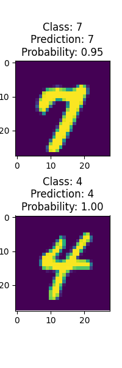

# PyTorch Playground

Welcome to the PyTorch Playground - a modular and flexible toolkit filled with neural network components built using 
_PyTorch_.
Whether you're just starting your deep learning journey or are a seasoned expert, this playground offers a range of
utilities, from experimenting with activations to building custom feed-forward networks with ease.


## Table of Contents


[//]: # (## Activations)

[//]: # ()
[//]: # (Find a collection of commonly-used activation functions in the `activations` package:)

[//]: # ()
[//]: # (- **Sigmoid**: `sigmoid&#40;x&#41;`)

[//]: # (- **Tanh**: `tanh&#40;x&#41;`)

[//]: # (- **ReLU**: `relu&#40;x&#41;`)

[//]: # (- **Swish**: `swish&#40;x, beta&#41;`)

[//]: # (- **CELU**: `celu&#40;x, alpha&#41;`)

[//]: # (- **Softmax**: `softmax&#40;tensor, dim, stable&#41;`)

[//]: # ()
[//]: # (Each is well-documented with its formula and PyTorch code.)

[//]: # ()
[//]: # (## Loss)

[//]: # ()
[//]: # (The `loss` package offers:)

[//]: # ()
[//]: # (- **Cross Entropy Loss**: `cross_entropy&#40;predictions, targets, stable, eps&#41;`)

[//]: # (- **Binary Cross Entropy Loss**: `binary_cross_entropy&#40;predictions, targets, stable, eps&#41;`)

[//]: # ()
[//]: # (## Devices)

[//]: # ()
[//]: # (The `devices` file introduces a `Device` enum that covers available devices &#40;CPU and CUDA&#41;)

[//]: # (for PyTorch.)

[//]: # ()
[//]: # (## Neural Network)

[//]: # ()
[//]: # (Within the `network` package:)

[//]: # ()
[//]: # (- `NeuralNetwork` is an abstract base class for all networks, offering a unified interface.)

[//]: # (  )
[//]: # (### FeedForward Network)

[//]: # ()
[//]: # (Defined in `feed_forward_network`, the `FeedForwardNetwork` class offers:)

[//]: # ()
[//]: # (- Customizable layers and activations.)

[//]: # (- Parameterized activations.)

[//]: # (- Ability to load weights, determine input layer size, and provide network details.)

[//]: # ()
[//]: # (### Evaluation)

[//]: # ()
[//]: # (`evaluation` offers `evaluate_network&#40;NeuralNetwork, VisionDataset, int, Device&#41;`, )
[//]: # (assessing a neural network's accuracy on a dataset.)

## MNIST Model Demo

`feed_forward_mnist` demonstrates the `FeedForwardNetwork`.
This function:

- Downloads MNIST.
- Transforms images.
- Selects two random images.
- Constructs a `FeedForwardNetwork`.
- Loads pre-trained model weights.
- Showcases the images, predictions, and overall accuracy.

### Sample



## Setup & Usage

1. Clone:
    ```
    git clone https://github.com/r8vnhill/pytorch-playground.git
    ```
2. Install:
    ```
    pip install -r requirements.txt
    ```
3. Execute your desired modules!

## Documentation

Each module in this module contains a `README.md` file with detailed documentation.

1. [Activation Functions](src/activations)


## Contribute

We'd love your contribution! Feel free to fork, submit a PR, or suggest improvements via issues.
Whether you've found a bug, have a feature request, or just want to provide feedback, your input is invaluable to
making _PyTorch Playground_ better for everyone.
