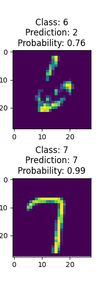

# PyTorch Playground

Dive into the PyTorch Playground - a toolkit of neural network components built with 
PyTorch.
Ideal for beginners keen on exploring activations or for pros aiming to tweak a custom 
feed-forward network.

## Table of Contents

1. [Activations](#activations)
2. [Devices](#devices)
3. [Neural Network](#neural-network)
    1. [FeedForward Network](#feedforward-network)
    2. [Evaluation](#evaluation)
4. [MNIST Model Demo](#mnist-model-demo)
5. [Setup & Usage](#setup--usage)
6. [Contribute](#contribute)

## Activations

Find a collection of commonly-used activation functions in the `activations` file:

- **Sigmoid**: `sigmoid(x)`
- **Tanh**: `tanh(x)`
- **ReLU**: `relu(x)`
- **Swish**: `swish(x, beta)`
- **CELU**: `celu(x, alpha)`
- **Softmax**: `softmax(tensor, dim, stable)`

Each is well-documented with its formula and PyTorch code.

## Devices

The `devices` file introduces a `Device` enum that covers available devices (CPU and CUDA)
for PyTorch.

## Neural Network

Within the `network` package:

- `NeuralNetwork` is an abstract base class for all networks, offering a unified interface.
  
### FeedForward Network

Defined in `feed_forward_network`, the `FeedForwardNetwork` class offers:

- Customizable layers and activations.
- Parameterized activations.
- Ability to load weights, determine input layer size, and provide network details.

### Evaluation

`evaluation` offers `evaluate_network(NeuralNetwork, VisionDataset, int, Device)`, 
assessing a neural network's accuracy on a dataset.

## MNIST Model Demo

`feed_forward_mnist` demonstrates the `FeedForwardNetwork`.
This function:

- Downloads MNIST.
- Transforms images.
- Picks two random images.
- Constructs a `FeedForwardNetwork`.
- Loads pre-trained model weights.
- Showcases the images, predictions, and overall accuracy.

### Sample



## Setup & Usage

1. Clone:
    ```
    git clone https://github.com/r8vnhill/pytorch-playground.git
    ```
2. Install:
    ```
    pip install -r requirements.txt
    ```
3. Execute your desired modules!

## Contribute

Fork, PR, or suggest improvements via issues!
